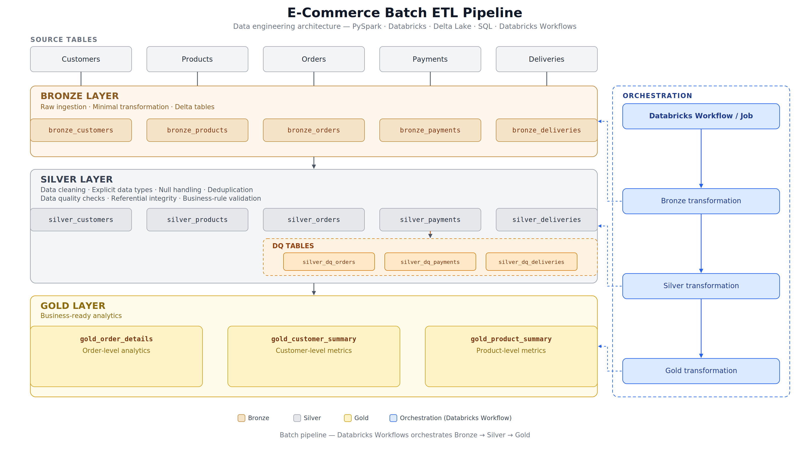

# E-Commerce Batch ETL Pipeline

An end-to-end batch ETL pipeline built using **PySpark and Databricks**, following a **Bronze → Silver → Gold** architecture.

The project processes e-commerce data across customers, products, orders, payments, and deliveries, performs data cleaning and quality validation, and produces business-ready analytical datasets.

## Architecture



## Tech Stack

* **PySpark**
* **Databricks**
* **Delta Lake**
* **SQL**
* **Git & GitHub**
* **Databricks Workflows**

## Pipeline Overview

The pipeline follows a layered architecture:

```text
Source Tables
     ↓
Bronze Layer
     ↓
Silver Layer
     ↓
Gold Layer
```

The complete pipeline is orchestrated using **Databricks Workflows**, with dependencies configured as:

```text
Bronze Transformation
        ↓
Silver Transformation
        ↓
Gold Transformation
```

---

## Source Data

The pipeline processes five e-commerce datasets:

| Dataset    | Description                     |
| ---------- | ------------------------------- |
| Customers  | Customer information            |
| Products   | Product and pricing information |
| Orders     | Customer orders and quantities  |
| Payments   | Payment transactions            |
| Deliveries | Order delivery information      |

The source datasets are loaded into Databricks and processed using PySpark.

---

## Bronze Layer

The Bronze layer is the **raw ingestion layer** of the pipeline.

The source tables are loaded into corresponding Delta tables with minimal transformation.

### Bronze Tables

* `bronze_customers`
* `bronze_products`
* `bronze_orders`
* `bronze_payments`
* `bronze_deliveries`

### Processing

The Bronze transformation:

* Reads the source tables using Spark
* Creates DataFrames for each dataset
* Stores the ingested data as Delta tables
* Uses batch processing to refresh the Bronze layer

---

## Silver Layer

The Silver layer prepares the ingested data for reliable downstream processing.

Data cleaning, standardization, deduplication, validation, and referential integrity checks are performed using PySpark.

### Data Cleaning

Key transformations include:

* Trimming whitespace from IDs and text fields
* Standardizing email addresses
* Standardizing status and payment-method values
* Converting columns to appropriate data types
* Converting order dates to `DATE`
* Removing duplicate records
* Filtering invalid quantities
* Filtering invalid product prices
* Validating payment amounts
* Handling invalid or missing order dates

### Silver Tables

* `silver_customers`
* `silver_products`
* `silver_orders`
* `silver_payments`
* `silver_deliveries`

### Data Quality Validation

The pipeline performs additional data-quality checks for:

* Null primary keys
* Duplicate records
* Invalid product prices
* Invalid order quantities
* Invalid payment amounts
* Invalid or missing order dates
* Referential integrity violations

Referential integrity is validated using Spark joins, including `left_anti` joins to identify records that do not have corresponding parent records.

### Data Quality Tables

Invalid records and their validation results are stored separately:

* `silver_dq_orders`
* `silver_dq_payments`
* `silver_dq_deliveries`

This allows data-quality issues to be identified without silently mixing invalid records with the cleaned Silver datasets.

---

## Gold Layer

The Gold layer contains **business-ready analytical datasets** created from the cleaned Silver data.

### Gold Tables

#### `gold_order_details`

Provides order-level information by combining relevant customer, product, payment, and delivery information.

Key logic includes:

* Order-level joins
* Order revenue calculation
* Payment availability flag
* Delivery availability flag
* Validation of one row per order

Order revenue is calculated using:

```text
order_revenue = quantity × unit_price
```

#### `gold_customer_summary`

Provides customer-level metrics such as:

* Total orders
* Total quantity purchased
* Total spend
* Delivered orders
* Cancelled orders
* Orders with payment records

#### `gold_product_summary`

Provides product-level metrics such as:

* Total orders
* Total quantity sold
* Total revenue

---

## Data Quality & Validation

Validation checks are performed throughout the pipeline rather than only at the final stage.

The project validates:

* Primary-key uniqueness
* Null values
* Duplicate records
* Valid business values
* Referential integrity
* Expected table grain
* Revenue consistency
* Payment and delivery relationships

The Gold layer also includes validation to ensure that the resulting datasets maintain the expected grain, such as one row per order for order-level data.

---

## Workflow Orchestration

The complete ETL pipeline is orchestrated using **Databricks Workflows**.

### Workflow

```text
┌──────────────────────────┐
│ Bronze Transformation    │
└────────────┬─────────────┘
             │
             ▼
┌──────────────────────────┐
│ Silver Transformation    │
└────────────┬─────────────┘
             │
             ▼
┌──────────────────────────┐
│ Gold Transformation      │
└──────────────────────────┘
```

The workflow uses task dependencies so that:

* Silver runs after Bronze succeeds
* Gold runs after Silver succeeds
* Failed upstream tasks prevent dependent tasks from running
* Retry configuration provides basic fault tolerance

The complete workflow has been successfully executed end-to-end.

---

## PySpark Concepts Demonstrated

This project applies practical PySpark concepts including:

* Spark DataFrames
* Explicit data types and casting
* DataFrame transformations
* `select`
* `filter`
* `withColumn`
* `dropDuplicates`
* `join`
* `left_anti`
* Aggregations
* Conditional expressions
* String functions
* Date functions
* Null handling
* Delta table reads and writes
* Data type conversion and standardization
* Batch processing

---

## Databricks Concepts Demonstrated

The project also demonstrates practical Databricks usage:

* Databricks notebooks
* Catalog and schema organization
* Delta tables
* Notebook-based ETL development
* Git integration
* GitHub version control
* Databricks Workflows
* Task dependencies
* Job retries
* End-to-end batch execution

---

## Repository Structure

```text
Ecommerce_batch_etl_pipeline/
│
├── README.md
├── ecommerce_etl_architecture.png
│
└── notebooks/
    ├── Bronze_transformation.ipynb
    ├── Silver_transformation.ipynb
    └── Gold_transformation.ipynb
```

---

## Project Outcome

The project demonstrates an end-to-end batch ETL workflow that:

1. Ingests multiple e-commerce datasets
2. Stores raw data in the Bronze layer
3. Cleans and validates data in the Silver layer
4. Performs joins and business transformations
5. Creates analytical Gold datasets
6. Performs data-quality and integrity checks
7. Orchestrates the complete pipeline using Databricks Workflows
8. Maintains the project using Git and GitHub

---

## Future Improvements

Potential extensions for a production-oriented version of the project include:

* Incremental processing
* AWS S3 integration
* Databricks Auto Loader
* Advanced Delta Lake features
* Cloud-based data storage
* Monitoring and alerting
* CI/CD integration
* Infrastructure as Code

These are **future enhancements** and are not part of the current implementation.
